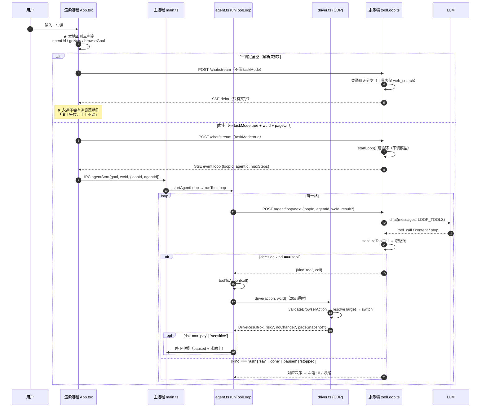

# ARCHITECTURE_REVIEW.md — AI 工作台 · 架构现状与「AI 打开浏览器后不执行操作」根因分析

> 审查日期：2026-09-21
> 审查对象：`work123` 仓库全量代码（`apps/desktop` + `apps/server` + `packages/shared`）
> 审查方式：**静态代码全量梳理**（未运行时代码，未做真机复现；结论均标注证据位置）
> 目的：供云端更高阶模型做架构审查与 Bug 排查

---

## 0. 一句话结论

**Agent Loop 本身是存在且完整的，动作指令也确实映射到了浏览器执行代码。**
用户看到的「打开浏览器后不执行操作」，**不是循环缺失，而是「发车前置闸」把任务挡在了循环之外**：

> 桌面渲染层用**纯本地正则白名单**（`detectOpenUrl` / `detectBrowseIntent` / `CONFIRM_ASK_RE`）判断「这句话要不要发车去操作浏览器」。
> 三判定全空 ⇒ **不携带 `taskMode:true`** ⇒ 服务端走**普通聊天分支**（该分支的工具表里**只有 `web_search`**，结构上不可能操作浏览器）⇒ 表现为「AI 嘴上答应了、手上不动」。
>
> 这条链子在源码注释里被**明确记录为「本轮要修的 bug 的根因」**（`apps/desktop/src/App.tsx:2015-2034`），但只针对「步数上限后的『继续』」这一种子场景做了短路修复，**其他措辞仍未覆盖**。

---

## 1. 当前系统架构图

### 1.1 进程拓扑（文字）

```
┌─────────────────────────────────────────────────────────────────────────┐
│  Electron 桌面端（apps/desktop）                                        │
│                                                                         │
│  ┌──────────────────────────────┐    ┌────────────────────────────────┐  │
│  │ 渲染进程（src/，React+Vite） │    │ 主进程（electron/）            │  │
│  │                              │    │                                │  │
│  │ · App.tsx      聊天/发车判定 │    │ · main.ts    IPC 编排/循环管理 │  │
│  │ · browser/     浏览器工作区  │◄──►│ · agent.ts   runToolLoop（手） │  │
│  │   intent.ts    意图正则判定  │IPC │ · driver.ts  drive()（CDP 执行）│  │
│  │   sites.ts     站点名判定    │    │ · pageState.ts 按 wcId 分片状态│  │
│  │   useBrowserWorkspace.ts     │    │ · server-supervisor.ts 拉起后端│  │
│  └──────────┬───────────────────┘    └───────────┬────────────────────┘  │
│             │ <webview>（guest，每页一个 wcId）  │ webContents.debugger    │
│             ▼                                    ▼ (CDP)                 │
└─────────────────────────────────────────────────────────────────────────┘
                                │ HTTP（Bearer JWT）/ SSE
                                ▼
┌─────────────────────────────────────────────────────────────────────────┐
│  服务端 Fastify（apps/server，:8787）                                   │
│                                                                         │
│  · routes/chat.ts   /chat/stream（普通聊天 + taskMode 建循环）           │
│  · routes/loop.ts   /agent/loop/{start,next,stop,pause,resume,info,live} │
│  · toolLoop.ts      ★ 脑：LOOP_TOOLS / LOOP_SYSTEM_PROMPT / advanceInner │
│  · llm.ts           DeepSeek（OpenAI 兼容）function calling              │
│  · pageState.ts / pageDelta.ts   按 wcId 分片的页面态 + 增量             │
└─────────────────────────────────────────────────────────────────────────┘
                                │
                                ▼
                    PostgreSQL（:5432，会话/消息/记忆/项目/智能体）
```

### 1.2 关键设计原则：**脑手分离 + 拉取式循环**

- **脑**在服务端（`toolLoop.ts`）：`advanceInner()` **每次只推进一格**，自身**不带任何循环**，必须被反复调用。
- **手**在桌面主进程（`agent.ts` 的 `runToolLoop`）：主动 `for(;;)` 轮询 `POST /agent/loop/next`，拿到决策 → 本地 `drive()` 执行 → 把回执带回下一次 `next`。
- **渲染进程绝不直连 CDP**：所有浏览器动作经由 IPC 交给主进程；主进程用 `webContents.debugger`（CDP）驱动 `<webview>` guest。
- 之所以是**拉取式**（而不是服务端推送/服务端自驱）：执行必须发生在用户机器上（`<webview>` 在桌面进程里），服务端拿不到 CDP。

### 1.3 Mermaid：端到端执行链路



---

## 2. Agent 执行链路完整流程梳理（任务下发 → 感知 → 决策 → 执行 → 校验）

对每一环节，列出**当前实现情况**、**关键代码位置**、**是否断裂**。

### 环节 1 · 任务下发（Dispatch）

| 项 | 内容 |
|---|---|
| 入口 | `App.tsx` `sendChat()`，判定逻辑在 `App.tsx:1928-1993` |
| 判定 | ① `openUrl = detectOpenUrl(value)`（`sites.ts`，正则识别站点名/开页句式）<br/>② `goNow = pendingConfirm && Boolean(pendingGoal)`（仅当上一条助手回复命中 `CONFIRM_ASK_RE` 且用户回「继续/可以」）<br/>③ `browseGoal = openUrl === null && activeTab ? detectBrowseIntent(value) : null`（`intent.ts`，**纯正则白名单**） |
| 发车 | `App.tsx:2102-2122`：`if (openUrl) {...}` / `else if (goNow) {...}` / `else if (browseGoal && activeTab) {...}` → 三条都调 `prepareDrive(...)` 设置模块级 `drive` 变量 |
| 真正发车 | `launch()`（`App.tsx:2089`）→ IPC `workbench:agent:start` |
| 请求体 | `App.tsx:2149`：`...(pendingDrive() ? { taskMode: true, pageUrl, wcId } : {})` |
| 服务端 | `routes/chat.ts:336` `if (body?.taskMode === true)` → `startLoop()` → SSE 推 `event:loop` |
| 渲染层收 | `App.tsx:2230` `else if (ev === 'loop' ...) { sawLoop = true; launch(j.loopId); }` |
| 兜底 | `App.tsx:2236` `if (pendingDrive() && !sawLoop) launch();`（流结束后若没拿到 loopId，让主进程自己建） |

**实现情况：✅ 存在，但 ⚠️ 断裂风险最高的一环。**

- **断裂点 D1（P0）**：三判定全空 ⇒ `drive` 保持 `null` ⇒ `taskMode` 不带 ⇒ **走普通聊天分支**。普通聊天分支的工具表**只有 `web_search`**（源码注释：`chat.ts:490`「浏览器那套工具**不在这条路上**（它只在 taskMode 的工具循环里给）」）⇒ 结构上不可能操作浏览器。
  - 触发措辞举例（当前正则**不覆盖**）：`帮我下单`、`帮我买东西`、`把这个页面上的商品整理一下`、`帮我把这个表单填了`、`诊断一下我的店铺`。
  - `BROWSE_ACT` 白名单（`intent.ts:28-29`）只收了：`搜一下|搜一搜|搜索|查一下|读一下|点一下|点击|往下滚|刷新|翻页|填一下|选中|勾选|搜索框|输入框|…` 等**动作动词**，且要求句长 ≤120 字、不是疑问句。
  - 另有 `EXTERNAL_OBJ`（`intent.ts:74`）会**主动排除**含「资料/论文/笔记/邮件/代码/简历/课本/教材/文献/《》/我的/你的」的句子 —— 例如「帮我把这个订单…」不含这些词能过，但「帮我读一下我邮箱里的订单」会被排除。
- **断裂点 D2（P1）**：`prepareDrive()`（`App.tsx:2066`）拿不到 `wcId` 时**只 `setChatNote` 然后 return**，`drive` 保持 `null`，用户只看到一句灰色提示，**任务静默丢失**。
- **断裂点 D3（P1）**：`launch()` 无 `loopId` 时由主进程自建循环 —— 这是**唯一**的「loop 事件丢失」兜底，但**仅在流正常结束**时执行（`await reader.read()` 正常 `done`）。若 SSE 被网络层掐断/抛异常，会走 `catch` 分支（`App.tsx:2251`），**兜底不执行**。

### 环节 2 · 感知（Perception / 读页面）

| 项 | 内容 |
|---|---|
| 工具 | `read_page`（`LOOP_TOOLS` 中定义，`toolLoop.ts`） |
| 执行 | `driver.ts` `readSnapshot()`（:1280）→ 产出 `PageSnapshot`（`packages/shared/src/index.ts:150`） |
| 注入 | 主进程把快照随 `POST /agent/loop/next` 的 `result.pageSnapshot` 回传服务端；服务端 `pageState.ts` 按 `wcId` 分片保存；每格把**最新快照 + 与上一格的 delta**（`pageDelta.ts`）注入模型消息 |
| 视觉 | `driver.ts` `captureScreenshot()`（:1860）—— 存在，`screenshot` 动作可用 |

**实现情况：✅ 存在且完整。**

- 可交互元素标注、DOM 提取、截图三条路都有（`read_page` / `screenshot` / `fill_form` 的字段枚举）。
- **注意**：快照**是否被喂给模型**取决于脑是否主动调 `read_page`。**若模型第一格直接决定 `stop` 或回一段纯文本，则一次页面都没读** —— 这是「打开后什么都没发生」的另一条可能路径（见环节 3）。
- ⚠️ `lastSnapshot` 在暂停排队时由主进程主动 `drive({action:'read_page'})` 生成（`main.ts:465` `pauseTask` 内），说明「主动感知」是可靠的，但**闲置时不会自动感知**。

### 环节 3 · 决策（Decision / 模型出动作）

| 项 | 内容 |
|---|---|
| 入口 | `toolLoop.ts` `advanceInner()`（:967） |
| 工具表 | `LOOP_TOOLS`：`open_url` / `read_page` / `click` / `type` / `scroll` / `stop`（6 个） |
| 提示词 | `LOOP_SYSTEM_PROMPT`（13 条规矩） |
| 调用 | `llm.ts` → DeepSeek，`toolChoice: 'auto'` |
| 分支 | `calls.length === 0` → `status='waiting'` + `kind:'say'`（**不继续，等用户说话**）<br/>`sanitizeToolCall` 不过 → push 消息 + `status='waiting'` + `ask`<br/>`stop` + `reason==='done'` → `status='done'` + `kind:'done'`<br/>`stop` + `need_user`/`blocked` → **`status='waiting'` + `kind:'ask'`**（绝不进终态）<br/>其余 → `{kind:'tool', call}` |
| 重入锁 | `LoopSession.advancing` 防并发推进；`LoopBusyError` → HTTP 409 |
| 步数闸 | `effectiveStepLimit` 默认**不限**（仅 200 步硬兜底）；撞闸 → `status='waiting'` + `kind:'ask', reason:'step_budget'` |

**实现情况：✅ 存在，⚠️ 但有「静默停等」的口子。**

- **断裂点 D4（P1）**：`calls.length === 0` ⇒ `kind:'say'` + `status='waiting'`。若模型第一格不调工具、只回一句话（例如「好的，我来帮你看」），循环就**停在那里等用户**，页面一动不动。而这条 `say` 的落地通道是 SSE（任务轮已经在流末尾 `res.end()` 了）⇒ **用户在界面上根本看不到这句话**（见断裂点 D6）。
- **断裂点 D5（P2）**：`toolChoice:'auto'` 不强制工具调用，模型「礼貌性回复」的概率非零，缺一条「首格必须调工具」的硬约束。

### 环节 4 · 执行（Execution / 浏览器动作）

| 项 | 内容 |
|---|---|
| 映射 | `agent.ts` `toolToAction(decision.call)`（`toolLoop.ts` 侧同名函数产出 `{action, ...}`） |
| 唯一入口 | `driver.ts` `drive(action, targetWebContentsId?)`（:1874） |
| 形状闸 | `validateBrowserAction(raw)`（:104）—— 动作名/参数类型不合法直接拒 |
| 目标解析 | `resolveTarget()` —— 按 `wcId` 定位 `<webview>` guest |
| 暂停闸 | `pausedOf(wcId) && PAUSED_BLOCKED.has(actionName)` 拦截 |
| 分支 | `open_url` / `click`（含 `payClickGuard` → `risk:'pay'`）<br/>`type`（含 `typeSensitiveGuard` → `risk:'sensitive'`）<br/>`scroll` / `wait` / `read_page` / `screenshot` / `fill_form` / `focus_sensitive_field` / `ask_user` / `done` |
| 超时 | `agent.ts` `EXEC_TIMEOUT_MS = 20_000`（:134）；`driver.ts` 内 CDP `CDP_TIMEOUT_MS = 8s` |

**实现情况：✅ 存在且完整，动作指令确实映射到了浏览器执行代码**（`drive()` → CDP `Input.dispatchMouseEvent` / `Input.insertText` 等）。

- 已核实：`click` / `type` / `scroll` / `read_page` 四条主路径在 `driver.ts` 里都有真实实现（`clickTarget` :1415、`typeInto` :1546、`scrollPage` :1764、`readSnapshot` :1280）。
- **断裂点 D7（P1）**：`EXEC_TIMEOUT_MS = 20s` 用 `Promise.race` 包裹。慢站（导航 + 首屏加载 > 20s）会被判 `res.ok=false`；`fails` 累计到 `FAILS_BEFORE_ASK = 2`（`agent.ts:121`）就 `ask` + `reason:'consecutive_failures'` 停住。**且「超时 ≠ 动作没执行」**（MEMORY.md 已记录的 `TOOL_OUTCOME_UNKNOWN`）⇒ 可能重复点击。
- **断裂点 D8（P1）**：`read_page` 会把 `staleClicks` 清零（MEMORY.md 已记录），导致「连点 3 次无变化」的安全闸在真实节奏里几乎碰不到。

### 环节 5 · 校验（Verify / 结果回执）

| 项 | 内容 |
|---|---|
| 回执 | `DriveResult`（`packages/shared/src/index.ts:198`）：`ok` / `error` / `risk?` / `noChange?` / `pageSnapshot?` |
| 回传 | `agent.ts` 把回执包进 `next` 的 `result`，服务端 `advanceInner` push `role:'tool'` 消息 + `session.step += 1` |
| 无变化检测 | `driver.ts` 比对动作前后快照 → `noChange: true` → `agent.ts` 累加 `staleClicks`；`staleClicks >= 3` → `ask` + `maybeRaiseHelp('连点 3 次页面都没变化')` |
| 高风险申报 | `res.risk === 'pay' | 'sensitive'` → `agent.ts:495+` 在 `if (res.ok)` **之前**拦截 → `ask` + `paused` + 求助卡（第 28 步） |
| 人工介入 | `maybeRaiseHelp()` 双条件闸：本地页面信号 `pageNeedsHuman(lastSnapshot)` **且** AI 确实卡住（`STUCK_ASK_REASONS`） |
| 用户可见 | 主进程 `emitAgent` → `workbench:browser:agent` 事件 → 渲染层浏览器工作区 |

**实现情况：✅ 存在且设计完整。⚠️ 但可见性有缺口。**

- **断裂点 D6（P0，观感直接相关）**：主进程的过程事件（`kind:'note'` 等）走的是 `workbench:browser:agent` 通道，**而任务轮的聊天内容走 `/chat/stream` 的 SSE** —— 两条通道不交叉。任务轮的 SSE 在 `sse(res,'done',...)` 后 **立刻 `res.end()`**（`chat.ts:380` 附近），此后主进程循环产出的所有 `note`/步骤/问话**都不会出现在会话气泡里**。
  - 结果：用户看到「我在这张页上动手了」一句开场白（其实是服务端模板文案 `chat.ts:364`，**不是真实执行记录**），然后**会话里长时间没有任何新内容** ⇒ 主观感受就是「卡住了」。
  - 浏览器工作区面板里其实有步骤流，但用户默认看的是会话。

---

## 3. 三层定位：哪层缺失 / 哪层断裂 / 哪层有问题

| 层 | 判定 | 说明 |
|---|---|---|
| **感知层** | ✅ **不缺失，基本健康** | `read_page` / `screenshot` / `fill_form` 三条路齐全；按 `wcId` 分片状态（`pageState.ts`）+ 增量（`pageDelta.ts`）设计合理。**唯一问题是被动**：不主动读页面，取决于模型当前格是否选择 `read_page`。 |
| **决策层** | ⚠️ **不缺失，但有「静默停等」口子** | `advanceInner` 分支完整、重入锁与 TTL 分层回收都在。问题在于：① `calls.length === 0` → `say` + `waiting`，模型一句话就把循环挂起；② `toolChoice:'auto'` 不强制首格调工具；③ **该 `say` 在任务轮没有可见通道**（D6）。 |
| **执行层** | ✅ **不缺失，映射完整** | `toolToAction` → `hooks.exec` → `drive(action, wcId)` → CDP，四段链路都在。问题只在**超时语义**（D7：20s 误判 + 超时≠未执行）与 `staleClicks` 误清零（D8）。 |
| **★ 下发层（真正的病灶）** | ❌ **断裂** | 这一层没有出现在用户给的三层分类里，但**它是「打开浏览器后不执行」的直接原因**。`App.tsx` 用**纯本地正则白名单**做「要不要发车」的判定，覆盖不足时 **`taskMode` 不带** ⇒ 服务端走普通聊天分支（无浏览器工具）⇒ 循环从未创建 ⇒ 三层再健康也永远不被触发。 |

---

## 4. 针对「AI 打开浏览器后不执行操作」的直接原因

用户给的两个具体问题，逐一回答：

### Q1：是否存在**持续**的 Agent Loop？

**答：存在，且是设计上的主动循环。**

- 桌面侧：`agent.ts` `runToolLoop()` 内 `for(;;)`，每格主动 `hooks.next(loopId, result)` 拉取决策。
- 服务端侧：`toolLoop.ts` `advanceInner()` **每次只推一格、自身无循环**，被反复调用。
- 存活管理：`LoopSession` 有 TTL 分层回收 —— 活跃态 `LOOP_TTL_MS = 10min`，等待态（`paused`/`waiting`）`WAITING_TTL_MS = 6h`。
- 并发上限 `MAX_LIVE_LOOPS = 32`，重入由 `advancing` 锁 + HTTP 409 保护。
- **结论：循环机制本身没有缺失。** 用户遇到的「不执行」发生在**循环创建之前**。

### Q2：动作指令是否真正映射到浏览器执行代码？

**答：真正映射，四段链路完整。**

```
服务端 LOOP_TOOLS（6 工具）
  → 模型返回 tool_call
  → advanceInner 产出 {kind:'tool', call}
  → agent.ts toolToAction(decision.call)   // 工具 → BrowserAction
  → hooks.exec(action)                     // 注入
  → main.ts 的 exec: (action) => drive(action, wcId)
  → driver.ts drive()                      // 唯一执行入口，形状闸 + 目标解析 + 暂停闸
  → CDP（webContents.debugger）→ <webview> guest 真实点击/输入/滚动
```

四段都在，且 `validateBrowserAction` 形状闸会拦住畸形动作（不会静默吞掉）。

### Q3：那「不执行」到底是为什么？—— 三条互相独立的原因链

**原因链 ①（P0，主因）：发车三判定全空 ⇒ 走普通聊天分支**

```
用户措辞不在 BROWSE_ACT 白名单里
  → detectBrowseIntent() 返回 null
  → openUrl/goNow/browseGoal 全空
  → drive === null → 不带 taskMode:true
  → chat.ts 走普通聊天分支（工具表 = { web_search }）
  → 模型说「好的我帮你操作」但**没有任何浏览器工具可用**
  → 表现：嘴上答应、手上不动
```
> 源码证据：`App.tsx:2015-2034` 的注释**已经把这条链写清楚了**，但修复只覆盖了「步数上限后的『继续』」这一种子场景（靠 `CONTINUE_STRONG_RE` 短路到 `resumeTask`）。
> `chat.ts:490` 注释：「浏览器那套工具**不在这条路上**（它只在 taskMode 的工具循环里给）」。

**原因链 ②（P1）：循环建了，但模型第一格不调工具**

```
advanceInner → calls.length === 0
  → status='waiting' + kind:'say'
  → 该 say 走 SSE，但任务轮的 SSE 已在 res.end() 后关闭
  → 用户界面**看不到这句话**
  → 表现：打开页面后彻底静默
```

**原因链 ③（P1）：循环建了、工具也调了，但执行被超时误判掐断**

```
慢站导航 > 20s（EXEC_TIMEOUT_MS）
  → Promise.race 判 res.ok=false
  → fails 累计 2 次（FAILS_BEFORE_ASK）
  → ask + reason:'consecutive_failures' → paused
  → 表现：动了一两下就停
```

**为什么三条都会**被用户描述成「打开浏览器后不执行」：因为三者对用户的**观感完全一致** —— 会话里只有一句开场白，然后没有下文。**这也是本次排查最需要警惕的地方：单一症状对应三条互斥根因，不能只修一条就宣布好了。**

---

## 5. 补充：整体架构的优点（供审查者参考）

1. **脑手分离彻底** —— 服务端只有脑（可水平扩展、可审计、模型可换），桌面只有手（不碰模型 key）。
2. **TTL 分层回收** —— 等待态给 6 小时而不是 10 分钟，避免用户去输密码回来发现循环已被回收。
3. **归属硬闸** —— `/agent/loop/next` 要求 `agentId`/`wcId` 自证相符（409 `agent_mismatch` / `page_mismatch`），防止两个智能体串号。
4. **暂停 ≠ 终止** —— `paused` 保留消息历史/步数/目标/快照；`stopped` 才是终态。恢复时「先重新感知、不盲目跳回旧地址」。
5. **高风险动作确定性申报** —— `DriveResult.risk` 由**执行层**（而非模型）标记，`agent.ts` 在 `if (res.ok)` 之前拦截，不依赖模型自觉。
6. **两级敏感闸** —— 服务端 `SENSITIVE_TARGET_RE`（拦「模型想去碰敏感字段」）+ 执行层 `typeSensitiveGuard`/`payClickGuard`（拦「真的碰了」），词表分离、互不依赖。
7. **人工介入卡片不搬 DOM** —— 影子层只把几何写成内联样式，webview `wcId` 不变、不卸载（搬 DOM 会销毁 guest）。

---

## 6. 建议的修复优先级（详见 BUG_LIST.md）

| 序 | 修什么 | 为什么这么排 |
|---|---|---|
| 1 | **发车判定改为「服务端能力协商」而非本地正则白名单**（或至少补一层「模型裁决兜底」） | 唯一能让「打开浏览器不执行」**全体症状**消失的改动；只补正则永远追不上用户措辞 |
| 2 | **任务轮增加可见通道**（把主进程 `note`/步骤/`say` 引流到会话气泡，或任务轮 SSE 保持长连） | 成本低、效果立竿见影：即使真卡住，用户也能看到卡在哪一步 |
| 3 | **给「首格必须调工具」加硬约束**（`tool_choice` 强制 / 提示词 + 一次重试） | 消除原因链 ② |
| 4 | **超时语义修正**（区分「超时未完成」与「执行失败」，不计入 `fails`） | 消除原因链 ③ 与重复点击风险 |
| 5 | **`prepareDrive` 拿不到 `wcId` 时改为显式失败**（红色错误 + 重试入口），不再静默 | 消除静默丢失 |

---

## 附录 A · 关键文件清单（含职责）

| 文件 | 行数 | 职责 |
|---|---|---|
| `apps/desktop/electron/main.ts` | 1913 | IPC 编排、`startAgentLoop`、lanes 管理、`pauseTask`/`resumeTask`、`emitAgent` |
| `apps/desktop/electron/agent.ts` | 633 | `runToolLoop`（手的主循环）、失败计数、`maybeRaiseHelp` |
| `apps/desktop/electron/driver.ts` | 2209 | `drive()` 唯一执行入口、CDP 点击/输入/滚动/快照、两级敏感闸 |
| `apps/desktop/electron/preload.ts` | — | `WorkbenchBridge` 白名单（contextBridge） |
| `apps/desktop/electron/pageState.ts` | — | 按 `wcId` 分片的页面态 |
| `apps/desktop/src/App.tsx` | ~2500 | 聊天、**发车判定（1928-1993）**、`prepareDrive`（2066）、`launch`（2089）、SSE 处理（2190-2240） |
| `apps/desktop/src/browser/intent.ts` | ~140 | `detectBrowseIntent` / `detectStopIntent` / `CONFIRM_ASK_RE` / `CONTINUE_*_RE` |
| `apps/desktop/src/browser/sites.ts` | — | `detectOpenUrl` / `looksLikeSiteName` / `looksLikeQuestion` / `PAGE_REF` |
| `apps/desktop/src/browser/useBrowserWorkspace.ts` | 1101 | 浏览器工作区状态机（`fullscreen`/`background`/`embed`） |
| `apps/server/src/toolLoop.ts` | 1245 | ★ 脑：`LOOP_TOOLS` / `LOOP_SYSTEM_PROMPT` / `advanceInner` / TTL |
| `apps/server/src/routes/chat.ts` | 779 | `/chat/stream`，普通聊天 + `taskMode` 建循环（336-383） |
| `apps/server/src/routes/loop.ts` | 528 | `/agent/loop/*` 九个端点 + 归属硬闸 |
| `apps/server/src/routes/agent.ts` | 385 | 老 `/agent/next-action` + 任务记账 |
| `packages/shared/src/index.ts` | 1252 | `BrowserAction` / `PageSnapshot` / `DriveResult` / `AgentLoopDecision` |

## 附录 B · 本次审查的局限

1. **纯静态审查**：未启动应用复现，三条原因链的**相对概率**未做实测排序。建议补一次真机日志采集（在 `App.tsx:1993` 后打印三判定结果 + 是否带 `taskMode`）。
2. `apps/server/src/pageState.ts` / `pageDelta.ts` / `llm.ts` 未逐行读（已确认职责，非本次症状的嫌疑点）。
3. `apps/desktop/electron/server-supervisor.ts`（772 行）未读 —— 若服务端被 supervisor 反复重启，也可能造成「循环建不起来」，但 `/health` 侧未发现问题。
