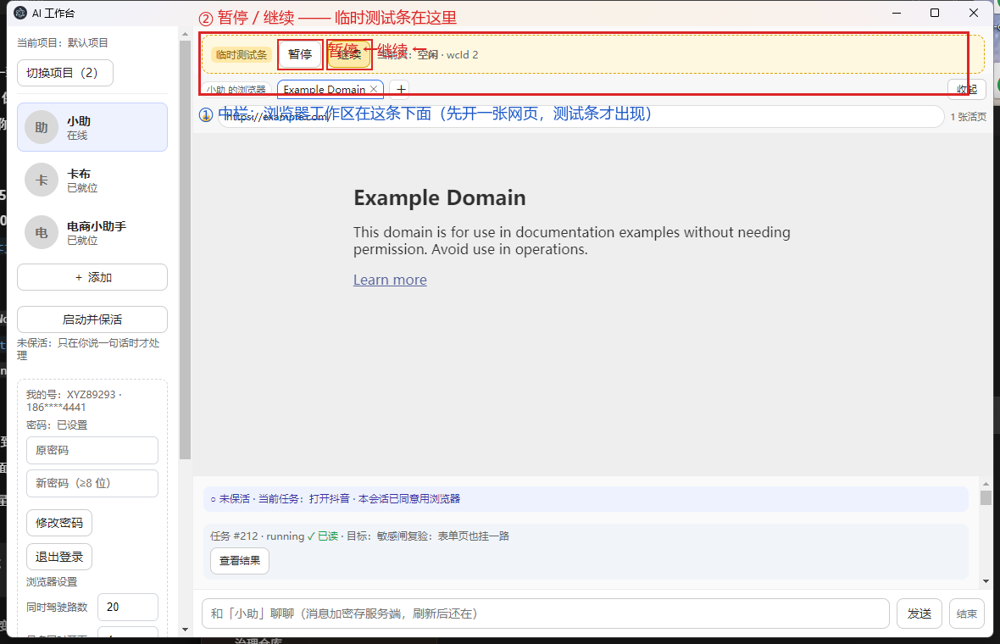

# 方案 B「暂停 / 继续」操作指南（已安装应用版）

> 这份指南给**最终用户**用，按步骤一步步走就能亲手验「暂停 → 自己操作 → 继续 → AI 重新感知」这条核心链。
>
> **本指南针对的是已经换装好的桌面应用**，不是 dev 模式。
> 换装（package 替换 / 缓存清理 / sha256 校验）已经在前面那一步完成，详见《验收报告.md》。

---

## 1. 双击哪个图标启动

桌面会有一个 **「AI 工作台」** 的快捷方式，双击它启动。底层可执行文件：

```
C:\Users\bing\AppData\Local\Programs\@ai-workbenchdesktop\AI 工作台.exe
```

如果桌面没快捷方式，去开始菜单找「AI 工作台」，或者直接双击上面那个 `.exe`。

启动后窗口标题是 **「AI 工作台」**。

> **首次 / 换装后第一次启动**：登录态保存在 Local Storage 里没动，照理直接进工作台；
> 万一停在登录页（看到「手机验证码」），按正常流程登一次就行（不影响换装本身）。

---

## 2. 暂停 / 继续按钮在哪（看图最直观）

**关键事实**：本阶段**没有正式的暂停/继续 UI**——右栏驾驶台已经在 UI-1.6 回滚里整块撤掉了。
为了让你能亲手验这条链，我们临时加了一条 **黄底虚框的「临时测试条」**：



它在界面上的位置（用截图里的坐标参照）：

| 位置 | 截图里的像素坐标（1180×760 窗口） | 含义 |
| --- | --- | --- |
| 临时测试条整体 | x≈238–1160, y≈41–87 | 黄底虚线框，紧贴浏览器工作区上方 |
| **暂停**按钮 | x≈329–379, y≈48–80 | 测试条里的第一个按钮 |
| **继续**按钮 | x≈387–437, y≈48–80 | 测试条里的第二个按钮 |

文字标注含义（红框里的红字）：

- **② 暂停 / 继续 —— 临时测试条在这里** —— 点这里
- **① 中栏：浏览器工作区在这条下面** —— 测试条**只在**中栏里**有网页时**才出现（没有开过页时它不渲染）

测试条上还能看到当前这张页的实时状态（每秒轮询刷新）：

- `AI 驾驶中` → AI 正在自动操作这张页
- `已暂停（页面归你操作）` → 暂停后这一段会变成这样
- `空闲` / `已完成` / `失败` —— 其它相位

---

## 3. 建议的亲手体验步骤（核心演示）

按这个顺序走一遍，就走完了方案 B 的全部验收点。

### 3.1 准备

1. 启动「AI 工作台」（双击桌面图标）。
2. 进工作台后，先**用聊天让 AI 打开一张网页**——比如对它说：
   ```
   打开 https://example.com
   ```
   等它开完，中栏会出现一张 example.com，**测试条会立刻显示在它上方**。
   （这一步只是为了让测试条出现，并不需要 AI 真的去做任何复杂操作。）

### 3.2 让 AI 在这张页上开始一件「会跑几步」的事

对它说：

```
在这个页面搜一下 example，点开搜索结果
```

（如果你想换成更真实的演示，让它去 `https://www.baidu.com` 搜个什么关键词再点链接也行。
关键是：这件事**需要 AI 多步操作**——这样你才有时间切出去点暂停。）

### 3.3 点暂停

在 AI **还没干完**的时候（聊天里能看到「打字中…」/ 或者驾驶状态显示 `AI 驾驶中`），
**点测试条里的「暂停」按钮**。

预期变化：

- 按钮旁的文字会从「AI 驾驶中」变成 **「已暂停（页面归你操作）」**。
- 聊天里的状态行也会反映出来。
- **AI 立刻不再动这张页**——浏览器里残留的最后状态就是暂停时的样子。

### 3.4 你自己接管这张页

现在**你**来操作这张页（AI 这时候真的不会动一下）：

- 在浏览器里**点别的链接**、**改 URL**、**输入点文本**，随你。
- 比如打开 https://example.com 后再点 example 的某个超链接 / 改改地址栏跳到 example.com/about/。
- 甚至**直接关掉这张页**也行——测试条上 `wcId` 会消失，但状态机会把这个 wcId 记成已停止。

### 3.5 点继续

操作完之后，点测试条里的 **「继续」** 按钮。

预期变化（**这才是方案 B 的核心**）：

- 按钮旁的文字从「已暂停（页面归你操作）」变回 **「AI 驾驶中」**。
- AI **不会**从头重放暂停前做过的动作 —— 不会「再点一次 example」。
- AI **先重新读一遍当前这张页**（你刚才改完的那一页），
  **按当前页的真实状态**接着干（要打开什么链接就看现在这页是什么）。

这点在聊天里也能看到：AI 继续后通常会说一句类似「页面已经变成 X 了，我接着…」的话，
而不是接着说它之前在说的那一句。

### 3.6 多路并行（可选、进阶）

如果你想验「暂停一路不影响别的路」：

1. 多开一张页（聊天里对它说 `打开 https://news.example.com`）。
2. 在两张页上各起一个任务。
3. 只点测试条里**当前激活那张页**对应的「暂停」——另外那张页的驾驶**完全不受影响**。

---

## 4. 注意事项

| 你看到 | 不是 bug | 真正的 bug |
| --- | --- | --- |
| 测试条上写着「空闲」 | 没起任务之前就是空闲；点了按钮也没效果（`wcId` 没就绪） | 一直停在「空闲」但其实在跑 |
| 「已暂停」状态下聊天还能打字 | **正确**：暂停只停驾驶、不锁聊天；你可以边说话边等它继续 | 「暂停」后再发消息它也不动（说明 pause 没生效） |
| 「继续」之后聊天里有「重新感知了页面 X」类的话 | **正确**：这就是方案 B 的关键证据 | 它接续暂停前那句做了一半的话（说明没重新读页） |
| 点「暂停」后页面 URL 还在变 | **正在跑的那路**会停下来；**别的页**仍在正常变化 | 点「暂停」后**两张**页都冻结了（说明串了路） |

---

## 5. 出问题怎么办

- **看不到测试条**：检查中栏有没有打开过网页（没有就不渲染）。让它打开一张就有了。
- **点按钮没反应**：检查测试条上的 `wcId` 字段有没有数字——没有就是 `<webview>` 还没就绪；等几秒再点。
- **换装后界面看着还是旧的**：清 Electron 缓存（见《验收报告.md》第三节的脚本 `.workbuddy-ai/clear-cache.mjs`）。

---

## 6. 截图原始文件

为了不在 git 里塞大文件，标注图原图在仓库下：

- `docs/acceptance/pause-resume/installed-ui-raw.png` —— 未标注原图
- `docs/acceptance/pause-resume/installed-ui-annotated.png` —— 本指南里的标注版